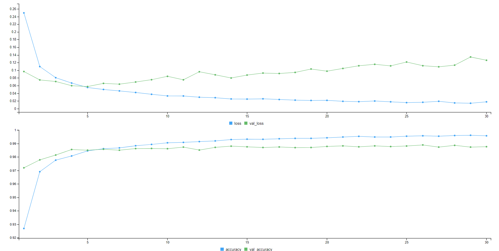

Hoda dataset is the first dataset of handwritten Farsi digits that has been developed during an MSc. project in Tarbiat Modarres University entitled: Recognizing Farsi Digits and Characters in SANJESH Registration Forms. 
In this project, a simple neural network has been designed to predict the corresponding number using the input image.

learning curve graph

predictions

