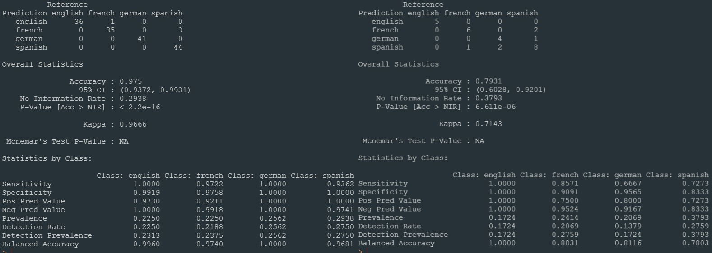

<pre>
A collection of 189 sentences about data mining derived from Wikipedia given in English, French, Spanish, and German.
The main goal is to train a classifier that recognize the language of a given text.

For this purpose, using cforests(Conditional Random Forests) Algorithm and umap(Uniform Manifold Approximation and Projection) for Dimension Reduction,
a model has been trained.

train results                                                  test results  
</pre>

